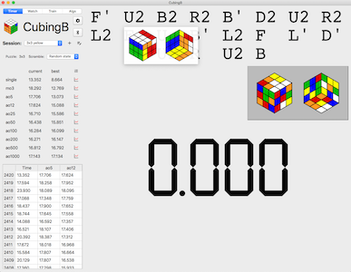
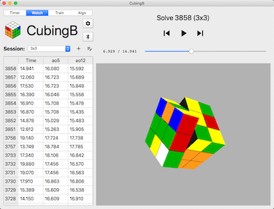
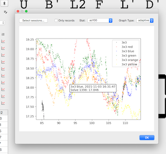

CubingB
=======

CubingB is a timer/analyzer for speedsolving Rubik's cubes (and related
puzzles). It focuses on supporting "smart cubes" (i.e. bluetooth cubes) for
recording the exact moves of a solve in real time.

CubingB is at a very early stage, and only supports macOS, and only the MoYu
Weilong AI for smart cube functionality. It's written in Python, and uses
PyQt and PyOpenGL for all sorts of graphical goodness, and pyobjc for binding
to macOS' native CoreBluetooth APIs for communicating with smart cubes. It
uses a SQLite database, managed with SQLAlchemy and Alembic.

This is just a hobby project written for my own use, so don't expect an easy
installation experience or much technical support. If you're not a programmer
that knows how to install Python packages, don't bug me with issues yet, please.

Features
---
* Normal cubing timer features
    * Basic scramble generation, single/aoX calculations, etc.
    * Full random state scramble support
    * Support for Square-1 and FTO (face-turning octahedron) scrambles
    * Sweet tooltip diagrams that pop up in the middle of scrambles in case
      you lose your place
    * Graphs: view graphs of a statistic (like "ao12" or "best ao100" or
      "solves per day") over time for one or more sessions. Also, see a list
      of the top solves for one or more sessions
    * Session management: renaming, drag-n-drop to reorder, and merge sessions
    * Algorithm database: see a big list of all algorithms, mark ones you know
* Smart cube support
    * Full incremental turn and gyroscope data recorded and timestamped throughout
      solves on a smart cube. This can be viewed later like a video, with
      play/pause/scrubbing. The data is stored in a compact binary format, but can
      still accumulate rather quickly (about 1K of data for 2-3 seconds of solving)
    * Algorithm training: choose an algorithm set, then solve the shown case as
      fast as you can. Then do it again.
    * Algorithm drilling: do the same algorithm over and over, and try to improve
      how fast you can do it
    * Click-and-drag to rotate, scroll to zoom on 3D cube viewer
    * Smart cube hotkeys: **r** to reset cube state (i.e. make the virtual cube
      solved), **c** to calibrate gyroscope (takes the current gyroscope position
      and assumes its the standard white top, green front orientation)
* Misc:
    * All solve data stored in a SQLite database for easy analytics (if you're
      nerdy enough to know SQL)
    * CSTimer importing (no interface, just a Python script for now)
    * No limits, no internet required, and no giving up your solve data. All your
      data is yours and yours alone.
    * Free and open source, yo

In the near future, the priority will be in analyzing solves (i.e. making sane
reconstructions incorporating the turn and gyroscope data, tracking algorithm
performance, etc.), as well as creating training exercises. That's the whole
reason I wanted a smart cube in the first place. This other stuff was just the
basics to get a decent timer that's good enough for typical usage.

Issues
---
* Cross platform support: PyQt can theoretically run on most platforms. Qt
  supports bluetooth, but apparently it doesn't support the BTLE
  advertisement/scanning, which I think is needed for the MoYu cube (at least
  I couldn't get it to work).
* Other smart cube support: support for the GAN i3 should be coming soon-ish,
  I got one but need to do some reverse engineering (much trickier than the MoYu).
  Other than that, we'll see.
* Minor weirdnesses with rotations/gyroscope: no idea! I'm out of my depth on
the math here at the moment. If you know how quaternions work, I'd love some help!

Misc/FAQ
---

**CubingB doesn't work!** That sucks!

**What does CubingB mean?** Well, it could potentially stand for CubingBuddy, 
CubingBenchmarker, or CubingBehemoth, but really it's just a dumb variation
on a [dumb joke](https://www.youtube.com/watch?v=VJMV-FFKcPU)
